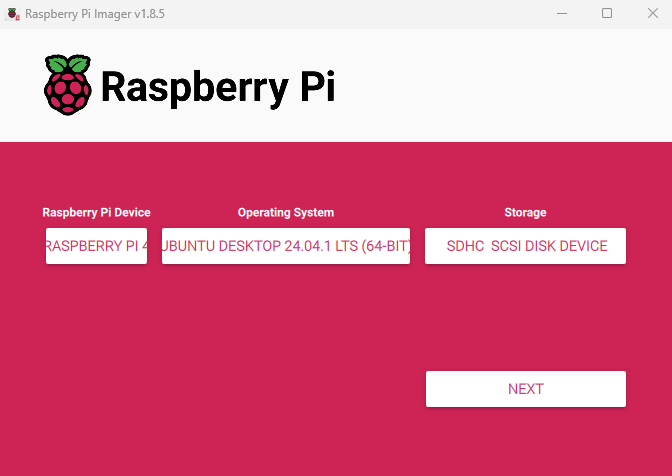

# GitHub-repo-med-installasjonsinstrukser-for-telefonkatalogen
 
1. Rasberry pi
    1. Gå på siden https://www.raspberrypi.com/software/ og blad ned til du finner rasberry pi imager på din egen pc windows 
    2. last ned rasberry pi imager
    3. Rasberry pi device put på rasberry på 4
    4. operativsystem bla ned til du ser på other general purpose klikk på Unbuntu så kommer det flere valg så klikker du på 64 bit
    5. så tar du sim kortet ut av rasberry pi og putte inn i laptopen din
    6. så klikker du på storage så vil det komme opp et valg
    
    sånn skal det se ut
    7. trykk på next så vil det komme en pop up at du skal slette det som er der klikk på yes
    8. ta inn sim kortet i rasbery pien
    9.  plugg inn ledningene og skru på rasberry pi 
    
#
2. upgradere pcen
    1. søk på terminalen og åpne
    1. skriv inn dette
    ```shell
    sudo apt update
    sudo apt upgrade
    ```
    vis dette ikke fungere 
    se om du har nett
    
    hvis du har nett skjekk om du har ip adresse på terminal
    ```shell 
    inet
    ```


3.
    ```shell 
    sudo apt install ufw
    sudo ufw enable 
    sudo ufw allow ssh
    sudo ufw status
    ```
